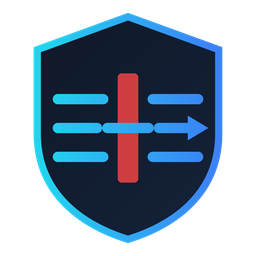

<div align="center">



# DPI Bypass — İndirme Sitesi

**Windows, Linux ve Android sürümlerinin tek yerden indirildiği, buzlu cam
(frosted glass) arayüzlü tanıtım ve indirme sitesi.**

*Yapımcı: Atom Gamer Arda A.G.A*

</div>

---

## Ne var?

- **İşletim sistemi otomatik algılanır** — siteye giren kullanıcı kendi
  platformunun sekmesini açık bulur, isterse elle değiştirir.
- **Windows:** doğrudan `.exe` indirme düğmesi + adım adım kurulum rehberi
  (SmartScreen uyarısı dahil) + PowerShell tek satır alternatifi.
- **Linux:** kopyalanabilir tek satırlık kurulum komutu, desteklenen
  dağıtımların listesi, kaldırma komutu.
- **Android:** doğrudan `.apk` indirme düğmesi + kurulum rehberi (bilinmeyen
  kaynak izni, Play Protect, VPN izni).
- Açık/koyu tema, klavyeyle gezinme, `prefers-reduced-motion` desteği,
  telefon/tablet uyumu.
- Derleme adımı yok: düz HTML + CSS + JavaScript. Çerçeve, paket, CDN yok.

## Sürümler ve bağlantılar

| Platform | Sürüm | Gereken | Dosya |
| --- | --- | --- | --- |
| Windows | 1.0.0.22 | Windows 10 ve 11 (64-bit) | [`DpiBypass-Setup-1.0.0.22.exe`](https://github.com/ATOMGAMERAGA/DPI-Bypass-Windows/releases/download/v1.0.0.22/DpiBypass-Setup-1.0.0.22.exe) |
| Android | 2.2.0 | Android 12 ve üstü | [`DPIBypass-2.2.0.apk`](https://github.com/ATOMGAMERAGA/DPI-Bypass-DC/releases/download/v2.2.0/DPIBypass-2.2.0.apk) |
| Linux | — | systemd + Python 3.8+ | `curl -fsSL .../install.sh \| sudo bash` |

Yeni sürüm çıktığında güncellenecek yerler:

- `index.html` — indirme düğmelerinin `href` değerleri ve sürüm yazıları
- `assets/js/app.js` — dosyanın başındaki `OS` tablosu

## Dosya düzeni

```
index.html            tek sayfa
assets/css/style.css  tasarım sistemi (jetonlar, cam yüzeyler, düzen)
assets/js/app.js      OS algılama, sekmeler, kopyalama, tema
assets/img/           logo ve favicon
nginx.conf            sunucu yapılandırması (gzip, önbellek, başlıklar)
Dockerfile            nginx:alpine tabanlı imaj
docker-compose.yml    yerel test
DOKPLOY.md            Dokploy'da yayına alma rehberi
```

## Yerel çalıştırma

Derleme gerekmez, herhangi bir statik sunucu yeter:

```bash
python3 -m http.server 8080
# → http://localhost:8080
```

Yayındakiyle birebir aynı davranışı görmek isterseniz (nginx + başlıklar):

```bash
docker compose up --build
# → http://localhost:8080
```

## Yayına alma

Dokploy ile adım adım: **[DOKPLOY.md](DOKPLOY.md)**

Kısaca: Dokploy'da **Application** oluşturun → GitHub deposunu ve
`claude/dpi-bypass-download-site-txylb5` (ya da `main`) dalını seçin →
**Build Type: Dockerfile** → alan adınızı ekleyip **HTTPS + Let's Encrypt**
işaretleyin → **Deploy**.

## Lisans

GPL-3.0 — bkz. [LICENSE](LICENSE).
